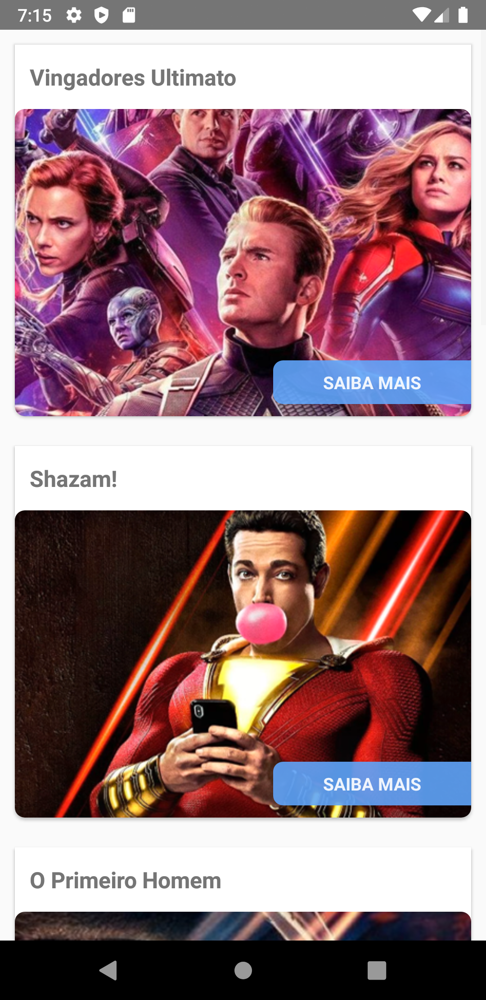

# Filmaria App

  
  

 

Sistema de visualização de sinopses de filmes em React-Native desenvolvido durante o curso de React.
 
 

  
  

## Como utilizar a aplicação

  
Como faço para testar?

  <ul style="margin-top: 5px, font-size: .7rem">
    <li>Clone este repositório na sua máquina.</li>
    <li>Abra o emulador do Android Studio.</li>
    <li>Entre no CMD e vá até a pasta do repositório clonado e digite: <code>npx react-native run-android</code> ou <code>yarn android</code> (caso tenha o Yarn instalado na sua máquina). </li>
  <ul>

Feito isso, o emulador reproduzirá exatamente essas telas no seu computador.
    
## Tecnologias utilizadas

- [x] React Native;
- [x] API REST.

## Desenvolvimento

<table>
  <tr>
    <td border="1px solid #ddd" align="center">
      <a href="https://github.com/wesleysantossts">
        
         
        Wesley Santos
      </a>
    </td>
  </tr>
</table>
